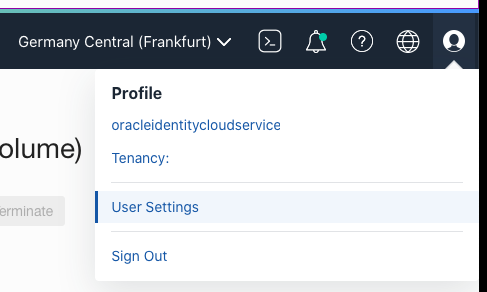
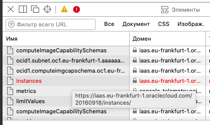
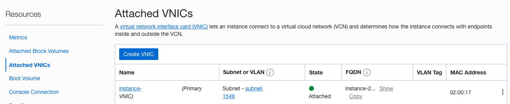

# OCI ARM Host Capacity Hunter

Automatically retry Oracle Cloud Infrastructure `LaunchInstance` API until free-tier ARM capacity becomes available in your home region.

Forked from [hitrov/oci-arm-host-capacity](https://github.com/hitrov/oci-arm-host-capacity), with simplified setup, Telegram notifications, boot-volume support, and a ready-to-use GitHub Actions workflow.

<p align="center">
  <a href="https://github.com/Hungzazed/oci-arm-host-capacity/actions/workflows/hunt.yml"></a>
</p>

> Each tenancy gets 3,000 OCPU hours + 18,000 GB hours / month free for `VM.Standard.A1.Flex` (up to 4 OCPUs / 24 GB RAM). Oracle adds capacity from time to time — this script polls `LaunchInstance` until it succeeds.

**Tip (2024+):** Many users upgrade to Pay-As-You-Go (PAYG) to get priority for free-tier launches. PAYG keeps Always Free benefits, adds fewer `Out of host capacity` errors, and unlocks more services. Set up budget alerts and watch what you deploy.

---

- [Features](#features)
- [Requirements](#requirements)
- [Quick start](#quick-start)
- [Configuration](#configuration)
- [Getting OCI_SUBNET_ID and OCI_IMAGE_ID](#getting-oci_subnet_id-and-oci_image_id)
- [Running](#running)
  - [Recommended: cron-job.org](#recommended-cron-joborg)
  - [Local / cron](#local--cron)
  - [GitHub Actions (fallback, delayed)](#github-actions-fallback-delayed)
  - [Multiple configs](#multiple-configs)
- [Telegram notification](#telegram-notification)
- [How it works](#how-it-works)
- [Assigning a public IP](#assigning-a-public-ip)
- [Troubleshooting](#troubleshooting)
- [Credits](#credits)

## Features

- Retries every Availability Domain on `Out of host capacity` (HTTP 500 + `InternalError`).
- Skips launch if `OCI_MAX_INSTANCES` of the same shape already exist (checks `ListInstances`).
- Caches `ListAvailabilityDomains` to `oci_cache.json` when `CACHE_AVAILABILITY_DOMAINS=1`.
- Backs off on HTTP 429 / `TooManyRequests` via `TOO_MANY_REQUESTS_TIME_WAIT` (state in `too_many_requests_waiter.txt`).
- Supports custom boot volume size (`OCI_BOOT_VOLUME_SIZE_IN_GBS`) or reuse of an existing boot volume (`OCI_BOOT_VOLUME_ID`).
- Sends Telegram message on success when configured.
- Runs locally, via cron, via [cron-job.org](https://cron-job.org) (recommended, no VPS idle needed), or via GitHub Actions (`.github/workflows/hunt.yml`, every 5 min — with delay, see below).

## Requirements

- PHP >= 7.0 < 9.0 with `ext-curl`, `ext-json`
- `composer`
- OCI Always Free (or PAYG) account with an API key

## Quick start

```bash
git clone https://github.com/Hungzazed/oci-arm-host-capacity.git
cd oci-arm-host-capacity
composer install
cp .env.example .env
# edit .env, then:
php ./index.php
```

Expected failure until capacity appears:

```json
{
    "code": "InternalError",
    "message": "Out of host capacity."
}
```

Success prints the new instance JSON and (optionally) sends a Telegram message.

## Configuration

Copy `.env.example` to `.env`. **Never commit `.env` — it contains secrets.**

### 1. API credentials

Generate an API key in OCI Console: Profile icon -> User Settings -> Resources -> API keys -> Add API Key -> Generate Key Pair -> Download Private Key -> Add. Copy the values shown into `.env`:

| Variable | Description |
|---|---|
| `OCI_REGION` | e.g. `eu-frankfurt-1` |
| `OCI_USER_ID` | `ocid1.user.oc1...` |
| `OCI_TENANCY_ID` | `ocid1.tenancy.oc1...` |
| `OCI_KEY_FINGERPRINT` | e.g. `b3:a5:90:...` |
| `OCI_PRIVATE_KEY_FILENAME` | Absolute path or public URL to the `.pem` file, e.g. `"/path/to/oci.pem"` |



### 2. Instance parameters

| Variable | Required | Default | Description |
|---|---|---|---|
| `OCI_SUBNET_ID` | Yes | — | See [below](#getting-oci_subnet_id-and-oci_image_id) |
| `OCI_IMAGE_ID` | Yes* | — | See below. *Not needed if `OCI_BOOT_VOLUME_ID` is set |
| `OCI_SSH_PUBLIC_KEY` | Yes | — | Contents of `~/.ssh/id_rsa.pub` in double quotes, single line, no newlines |
| `OCI_SHAPE` | Yes | — | `VM.Standard.A1.Flex` (ARM) or `VM.Standard.E2.1.Micro` (AMD) |
| `OCI_OCPUS` | Yes | `4` | ARM: `1/2/3/4` (AMD: `1`) |
| `OCI_MEMORY_IN_GBS` | Yes | `24` | ARM: `6/12/18/24` (AMD: `1`). Oracle Linux Cloud Developer image needs >= 8 |
| `OCI_MAX_INSTANCES` | No | `1` | Max existing instances of the same shape before skipping |
| `OCI_AVAILABILITY_DOMAIN` | Optional for ARM | empty | Leave empty to auto-discover all ADs. **Required** for AMD `E2.1.Micro` (must be the Always Free Eligible AD) and for `OCI_BOOT_VOLUME_ID` |
| `OCI_BOOT_VOLUME_SIZE_IN_GBS` | No | empty | Custom boot volume size, 50–200 GB for Always Free (min 47 AMD / 50 ARM) |
| `OCI_BOOT_VOLUME_ID` | No | empty | Reuse existing boot volume OCID. Cannot combine with size above. Must set `OCI_AVAILABILITY_DOMAIN` to the same AD |
| `CACHE_AVAILABILITY_DOMAINS` | No | `1` | `1` = cache AD list in `oci_cache.json` to reduce API calls |
| `TOO_MANY_REQUESTS_TIME_WAIT` | No | `600` | Seconds to pause after HTTP 429. `0` / empty = disabled |
| `TELEGRAM_BOT_API_KEY` | No | empty | See [Telegram](#telegram-notification) |
| `TELEGRAM_USER_ID` | No | empty | See [Telegram](#telegram-notification) |

AMD Always Free example:

```bash
OCI_SHAPE=VM.Standard.E2.1.Micro
OCI_OCPUS=1
OCI_MEMORY_IN_GBS=1
OCI_AVAILABILITY_DOMAIN=FeVO:EU-FRANKFURT-1-AD-2
```

Get your SSH public key:

```bash
cat ~/.ssh/id_rsa.pub
# ssh-ed25519 AAAAC3NzaC1lZDI1NTE5AAAAI... user@example.com
```

## Getting OCI_SUBNET_ID and OCI_IMAGE_ID

1. In OCI Console go to Menu -> Compute -> Instances -> Create Instance.
2. Pick image + shape (`VM.Standard.A1.Flex`, 4/24). For AMD check the `Always Free Eligible` label.
3. In Networking, select an existing VCN/subnet (create a `VM.Standard.E2.1.Micro` first if you have none). Uncheck public IP for now.
4. Open browser DevTools -> Network tab, click Create, wait for the `Out of capacity` error.
5. Find the red `/instances` POST, right-click -> Copy as cURL, paste into an editor, read `subnetId`, `imageId`, `availabilityDomain` from `--data-binary`.
6. Set `OCI_SUBNET_ID`, `OCI_IMAGE_ID` accordingly.



## Running

### Recommended: cron-job.org

Use [cron-job.org](https://cron-job.org) (free) to ping your hosted script every minute — this is more reliable than GitHub Actions for catching short capacity windows.

1. Host this project on a public URL (any cheap VPS / shared hosting with PHP, e.g. `https://your-domain.com/oci-arm-host-capacity/index.php`).
   - Set `OCI_PRIVATE_KEY_FILENAME` in `.env` to a public URL of your `.pem` (or an OCI Object Storage pre-authenticated URL), because the web host must fetch it.
   - Visiting that URL should print the same JSON as `php ./index.php` (`Out of host capacity` until success).
2. Sign up at [cron-job.org](https://cron-job.org) -> Create cronjob:
   - URL: `https://your-domain.com/oci-arm-host-capacity/index.php`
   - Interval: every 1 minute (or 2–5 minutes to stay under OCI rate limits).
   - Request timeout: 30s, enable logging / failure notification.
3. Done. You will get a Telegram message on success (if configured). Disable/delete the cron-job once your instance is created.

Why not GitHub Actions? See [below](#github-actions-fallback-delayed) — scheduled workflows are queued and often delayed 10–30+ minutes, so you can easily miss capacity that appears for only a few minutes.

### Local / cron

```bash
php ./index.php
# with a custom env file:
php index.php .env.my_acc1
```

Cron (every minute):

```bash
touch /path/to/oci-arm-host-capacity/oci.log
chmod 644 /path/to/oci-arm-host-capacity/oci.log
which php  # usually /usr/bin/php
EDITOR=nano crontab -e
```

```
* * * * * /usr/bin/php /path/to/oci-arm-host-capacity/index.php >> /path/to/oci-arm-host-capacity/oci.log 2>&1
```

Use absolute paths. For permission issues run `sudo crontab -e` or fix file ownership instead of `chmod 777`.

### GitHub Actions (fallback, delayed)

> ⚠️ **Expected delay:** GitHub schedules `cron` workflows on best-effort basis. Even with `*/5 * * * *` in `hunt.yml`, runs are queued behind other jobs, can start 10–30+ minutes late during peak hours, take 1–2 minutes just to provision `ubuntu-latest` + PHP + `composer install`, and may be skipped entirely if the repo is inactive (GitHub disables schedules after 60 days without activity). OCI free capacity often disappears in minutes, so GitHub Actions can miss it. Prefer [cron-job.org](#recommended-cron-joborg) or local cron for real hunting; use Actions only for testing.

`hunt.yml` runs every 5 minutes plus manual `workflow_dispatch`. No `.env` file needed — all values come from repository Secrets / Variables.

1. Fork this repo.
2. Go to Settings -> Secrets and variables -> Actions -> New repository secret, add one by one (same names as `.env`, **no quotes**):
   `OCI_REGION`, `OCI_USER_ID`, `OCI_TENANCY_ID`, `OCI_KEY_FINGERPRINT`, `OCI_SUBNET_ID`, `OCI_IMAGE_ID`, `OCI_OCPUS`, `OCI_MEMORY_IN_GBS`, `OCI_SHAPE`, `OCI_MAX_INSTANCES`, `OCI_AVAILABILITY_DOMAIN`, `OCI_SSH_PUBLIC_KEY`, `CACHE_AVAILABILITY_DOMAINS`, `OCI_BOOT_VOLUME_SIZE_IN_GBS`, `OCI_BOOT_VOLUME_ID`, `TOO_MANY_REQUESTS_TIME_WAIT`, `TELEGRAM_USER_ID`, `TELEGRAM_BOT_API_KEY`, plus:
   - `OCI_PRIVATE_KEY_CONTENT` — full contents of the `.pem` file (workflow writes it to `/tmp/oci.pem`).
3. Push / go to Actions -> Hunt ARM -> Run workflow to test.
4. Disable or delete the workflow once your instance is created to stop polling.

> Do not use GitHub-hosted runners for unrelated long-running polling beyond testing your own repo — it can violate [GitHub Actions terms](https://docs.github.com/en/site-policy/github-terms/github-terms-for-additional-products-and-features#actions). Prefer [cron-job.org](#recommended-cron-joborg) or cron/VPS for continuous hunting.

### Multiple configs

Pass a custom env filename as CLI arg for multiple accounts:

```bash
php index.php .env.my_acc1
```

Web SAPI (Apache/nginx) ignores `$argv` — wire e.g. `$_GET` to `$envFilename` in `index.php` if you need it there.

## Telegram notification

1. Create a bot via [@BotFather](https://core.telegram.org/bots), get the token -> `TELEGRAM_BOT_API_KEY`.
2. Get your numeric chat ID (e.g. via [@userinfobot](https://t.me/userinfobot)) -> `TELEGRAM_USER_ID`.
3. Set both in `.env` (or GitHub Secrets). On successful launch you get the instance JSON in Telegram.

## How it works

`index.php` -> `OciApi`:

1. `ListInstances` in your compartment. If count of non-`TERMINATED` instances with the same shape >= `OCI_MAX_INSTANCES`, print `Already have an instance(s)...` and exit.
2. `ListAvailabilityDomains` (or use `OCI_AVAILABILITY_DOMAIN` / cache) to get ADs to try.
3. `LaunchInstance` per AD with `shapeConfig` (`ocpus`/`memoryInGBs`), `sourceDetails` (image or boot volume), VNIC with `assignPublicIp: false`.
4. On `Out of host capacity` (500), sleep 16s and try next AD. On 429, enable waiter for `TOO_MANY_REQUESTS_TIME_WAIT` seconds. Other errors stop immediately.

## Assigning a public IP

The script creates instances without public IP (ephemeral limit is 2/compartment). After success: OCI Console -> Instance Details -> Attached VNICs -> select VNIC -> IPv4 Addresses -> Edit -> Ephemeral -> Update.



Login (default user `opc`):

```bash
ssh -i ~/.ssh/id_rsa opc@<public-ip>
# or via private DNS from another instance in the same VCN:
ssh -i ~/.ssh/id_rsa opc@instance-20210714-xxxx.subnet.vcn.oraclevcn.com
```

## Troubleshooting

| Symptom | Cause / fix |
|---|---|
| `PrivateKeyFileNotFoundException` / file does not exist | `OCI_PRIVATE_KEY_FILENAME` path wrong. Verify with `cat /path/to/oci.pem`. For URL form keep it in quotes and check `curl "https://..."` returns the key without redirect/login |
| `Permission denied` reading `.pem` | Fix ownership / `chmod 600`. Ensure cron user can read it |
| `InvalidParameter: Unable to parse message body` | `OCI_SSH_PUBLIC_KEY` contains newlines. Must be one line in double quotes |
| `InvalidParameter: Invalid ssh public key; must be in base64 format` | Wrong key pasted. Re-copy `~/.ssh/id_rsa.pub` or regenerate |
| `LimitExceeded: standard-a1-...` | Quota hit, not capacity — you already have max instances or need limit increase |
| `TooManyRequests` loop / `Will retry after N seconds` | Rate-limited by OCI. Increase `TOO_MANY_REQUESTS_TIME_WAIT` or slow down cron/schedule |
| `OCI_BOOT_VOLUME_ID and OCI_BOOT_VOLUME_SIZE_IN_GBS cannot be used together` | Set only one of them |
| `OCI_AVAILABILITY_DOMAIN must be specified...` with boot volume | Boot volume is AD-bound — set `OCI_AVAILABILITY_DOMAIN` to the same AD as the volume |

## Credits

- Original project + OCI request signer: [Alexander Hitrov](https://github.com/hitrov/oci-arm-host-capacity)
- [Medium article](https://hitrov.medium.com/resolving-oracle-cloud-out-of-capacity-issue-and-getting-free-vps-with-4-arm-cores-24gb-of-6ecd5ede6fcc) and [signer package](https://github.com/hitrov/oci-api-php-request-sign)
- This fork: GitHub Actions `hunt.yml`, secrets-based config, docs refresh. MIT License — see [LICENSE](LICENSE).
